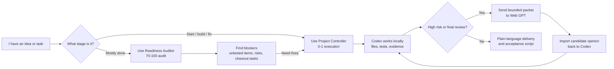

# Codex for Humans

小白也能用的 Codex 專案總控 Skills。

Codex for Humans is a beginner-friendly workflow kit for people who want to use Codex to build software projects without reading code. It turns vague ideas into structured tasks, evidence-based checks, safer review loops, and plain-language delivery notes.

## 10-Second Map



Simple rule:

```text
0-1: build with $nontechnical-codex-project-controller
70-100: audit with $nontechnical-project-readiness-auditor
Web GPT: outside review only, never local proof
```

## Who This Is For

- You do not read code, but you want to build software with Codex.
- You get lost when Codex spends many tokens, fixes many bugs, and changes many files.
- You want a repeatable SOP for every project.
- You want to separate 0-1 building from 70-100 delivery checking.
- You want Web GPT or another model to review plans without replacing local evidence.

## What Is Inside

```text
codex-for-humans/
+-- skills/
|   +-- nontechnical-codex-project-controller/
|   +-- nontechnical-project-readiness-auditor/
+-- prompts/
+-- templates/
+-- docs/
+-- examples/
```

## The Two Core Skills

### 1. 0-1 Project Controller

Use this when you want Codex to plan, build, debug, test, and deliver a project or feature.

Skill name:

```text
$nontechnical-codex-project-controller
```

Best for:

- New project
- New feature
- Bug fix
- Long Codex task
- High-risk task that needs approval gates
- Web GPT review packet before or after Codex work

### 2. 70-100 Readiness Auditor

Use this when a project is already mostly done and you want to know what is missing before delivery.

Skill name:

```text
$nontechnical-project-readiness-auditor
```

Best for:

- Delivery readiness audit
- Current score
- Untested item list
- High-risk gap list
- Final Web GPT review packet
- Nontechnical acceptance script
- Minimal closeout task list

## Quick Start

Visual install guide:


1. Copy both folders in `skills/` into your Codex skills folder.

Windows:

```powershell
Copy-Item -Recurse -Force .\skills\* "$env:USERPROFILE\.codex\skills\"
```

macOS / Linux:

```bash
cp -R ./skills/* ~/.codex/skills/
```

2. Open Codex in your target project.

3. Use one of the prompts in `prompts/`.

For a brand-new project, use:

```text
prompts/01-start-new-project.md
```

For a nearly finished project, use:

```text
prompts/02-audit-70-to-100-project.md
```

For a real beginner walkthrough, read:

```text
examples/clinic-booking-system.zh-TW.md
```

For a visual install guide, read:

```text
docs/INSTALL_VISUAL.zh-TW.md
```

## Simple Operating Rule

Use this split:

```text
0-1: build with $nontechnical-codex-project-controller
70-100: audit with $nontechnical-project-readiness-auditor
```

If the audit finds work that must be fixed, hand that task back to the project controller.

## Web GPT Review Loop

Web GPT can help review plans, risks, missing tests, and logic gaps.

But Web GPT does not prove the local project works.

Use this rule:

```text
Codex executes locally.
Web GPT reviews as an outside opinion.
Tests, builds, screenshots, logs, and local artifacts are the proof.
```

See:

```text
docs/WEB_GPT_REVIEW_LOOP.zh-TW.md
```

## Safety

Do not publish secrets.

Never upload:

- API keys
- passwords
- access tokens
- cookies
- private Discord or exchange credentials
- production logs containing sensitive data
- account IDs or private user data

Before making this repo public, follow:

```text
docs/PUBLICATION_CHECKLIST.zh-TW.md
```

## Suggested Repo Description

```text
Beginner-friendly Codex skills and prompts for nontechnical owners to plan, build, audit, and ship software projects.
```

## License

MIT. See `LICENSE`.
