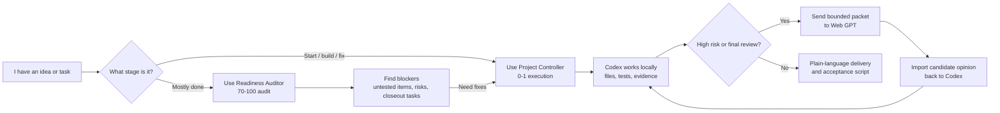
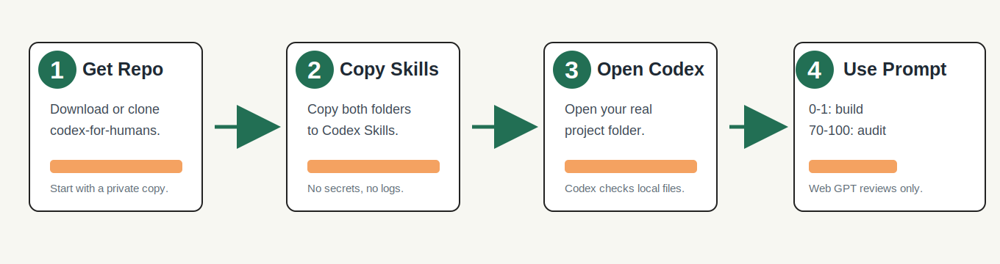
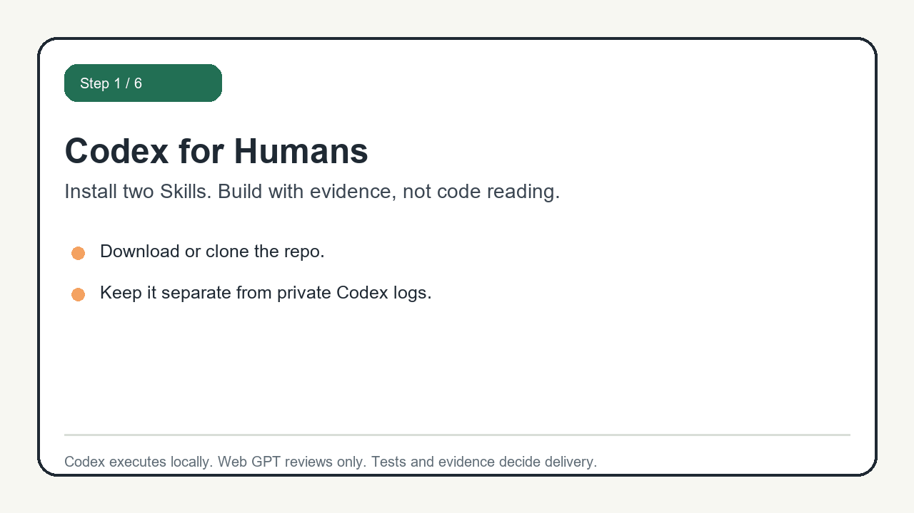

# Codex for Humans

小白也能用的 Codex 專案總控 Skills。

Codex for Humans is an unofficial workflow kit for nontechnical owners who want to use Codex to build software projects without reading code.

It is not a single magic prompt. It is a small system of Codex Skills, prompts, and templates that helps you:

- turn vague ideas into clear task contracts
- make Codex work in small, testable rounds
- separate building from delivery readiness auditing
- require evidence before calling work "done"
- use Web GPT as an outside reviewer without treating it as local proof
- avoid high-risk actions such as real payments, real trades, production deployment, real user data, secrets, and irreversible changes without explicit approval

## 10-Second Map



Simple rule:

```text
0-1: build with $nontechnical-codex-project-controller
70-100: audit with $nontechnical-project-readiness-auditor
Web GPT: outside review only, never local proof
```

Codex executes locally.
Web GPT only gives candidate review.
Tests, builds, local evidence, and human approval decide whether something is actually ready.

## Safety First

Codex for Humans helps you structure Codex work. It does not guarantee that your software is correct, secure, legal, deployable, or safe for real money.

Before using this workflow with production systems, real user data, payments, trading, permissions, security settings, or irreversible operations:

- use sandbox, fake data, test accounts, dry run, or local simulation first
- do not paste secrets, API keys, tokens, cookies, passwords, or private keys into chat
- require explicit human approval before high-risk actions
- require a rollback or recovery plan before deployment, database changes, permissions changes, payments, trading, or destructive operations
- ask a qualified human reviewer when legal, financial, medical, security, or compliance risk exists

Web GPT review is only an outside opinion. It is not local test evidence, not approval, and not proof that the project is safe to ship.

## Who This Is For

- You do not read code, but you want to build software with Codex.
- You get lost when Codex spends many tokens, fixes many bugs, and changes many files.
- You want a repeatable SOP for every project.
- You want to separate 0-1 building from 70-100 delivery checking.
- You want Web GPT or another model to review plans without replacing local evidence.

## What Is Inside

```text
codex-for-humans/
+-- skills/
|   +-- nontechnical-codex-project-controller/
|   +-- nontechnical-project-readiness-auditor/
+-- prompts/
+-- templates/
+-- docs/
+-- examples/
```

## The Two Core Skills

### 1. 0-1 Project Controller

Use this when you want Codex to plan, build, debug, test, and deliver a project or feature.

Skill name:

```text
$nontechnical-codex-project-controller
```

Best for:

- New project
- New feature
- Bug fix
- Long Codex task
- High-risk task that needs approval gates
- Web GPT review packet before or after Codex work

### 2. 70-100 Readiness Auditor

Use this when a project is already mostly done and you want to know what is missing before delivery.

Skill name:

```text
$nontechnical-project-readiness-auditor
```

Best for:

- Delivery readiness audit
- Current score
- Untested item list
- High-risk gap list
- Final Web GPT review packet
- Nontechnical acceptance script
- Minimal closeout task list

## Quick Start

Visual install guide:



GIF install demo:



1. Find your Codex Skills folder.

Codex Skills 的安裝路徑可能因 Codex 版本或環境不同而不同。

請優先依你目前 Codex 版本的官方文件或 `/skills` 說明確認 Skills 路徑。

Common paths may include:

- `~/.agents/skills/`
- `~/.codex/skills/`

If one path does not work, use the Skills directory shown by your Codex app or CLI.

2. Copy both folders in `skills/` into your Codex Skills folder.

Windows:

```powershell
Copy-Item -Recurse -Force .\skills\* "$env:USERPROFILE\.codex\skills\"
Copy-Item -Recurse -Force .\skills\* "$env:USERPROFILE\.agents\skills\"
```

macOS / Linux:

```bash
cp -R ./skills/* ~/.codex/skills/
cp -R ./skills/* ~/.agents/skills/
```

Use the command for the path that exists on your machine. You do not need to use both.

3. Restart Codex and verify the Skills are visible.

可嘗試使用 `/skills` 或輸入 `$` 查看可用 Skills。確認能看到：

- `nontechnical-codex-project-controller`
- `nontechnical-project-readiness-auditor`

If you cannot see them, check:

1. Skill 是否放在正確的 Codex Skills 目錄
2. 每個 Skill 資料夾內是否有 `SKILL.md`
3. 是否重新啟動 Codex
4. 是否放錯到 repo 內，而不是 Codex 的 Skills 目錄

4. Open Codex in your target project.

5. Use one of the prompts in `prompts/`.

For a brand-new project, use:

```text
prompts/01-start-new-project.md
```

For a nearly finished project, use:

```text
prompts/02-audit-70-to-100-project.md
```

For a real beginner walkthrough, read:

```text
examples/clinic-booking-system.zh-TW.md
examples/clinic-booking-system.en.md
```

For a visual install guide, read:

```text
docs/INSTALL_VISUAL.zh-TW.md
```

For one-click install, read:

```text
docs/ONE_CLICK_INSTALL.zh-TW.md
```

For the GIF install guide, read:

```text
docs/INSTALL_GIF.zh-TW.md
```

For your first 10 minutes, read:

```text
docs/FIRST_10_MINUTES.zh-TW.md
```

## Simple Operating Rule

Use this split:

```text
0-1: build with $nontechnical-codex-project-controller
70-100: audit with $nontechnical-project-readiness-auditor
```

If the audit finds work that must be fixed, hand that task back to the project controller.

## Recommended Project Setup

For each software project you manage with Codex:

1. Copy `templates/AGENTS.md` into your target project root.
2. Fill in your project goal, test commands, risk areas, and handoff rules.
3. Keep project-specific details in your project files, not inside the reusable Skills.

Recommended files inside your own project:

- `AGENTS.md`: project-level Codex instructions
- `PROJECT_RULES.md`: project-specific rules
- `DECISION_LOG.md`: why decisions were made
- `EVIDENCE_LEDGER.md`: what was changed and how it was verified
- `RISK_REGISTER.md`: known risks and high-risk areas

The Skills provide the workflow.
Your project files provide the project-specific facts.

`AGENTS.md` can point Codex to the other files, or you can explicitly ask Codex to read them.

## Web GPT Review Loop

Web GPT can help review plans, risks, missing tests, and logic gaps.

But Web GPT does not prove the local project works.

Use this rule:

```text
Codex executes locally.
Web GPT reviews as an outside opinion.
Tests, builds, screenshots, logs, and local artifacts are the proof.
```

See:

```text
docs/WEB_GPT_REVIEW_LOOP.zh-TW.md
```

## Safety

Do not publish secrets.

Never upload:

- API keys
- passwords
- access tokens
- cookies
- private Discord or exchange credentials
- production logs containing sensitive data
- account IDs or private user data

Before making this repo public, follow:

```text
docs/PUBLICATION_CHECKLIST.zh-TW.md
```

## Suggested Repo Description

```text
Unofficial Codex Skills and prompts for nontechnical owners to plan, build, audit, and ship software projects with evidence, not code reading.
```

## License

MIT. See `LICENSE`.
