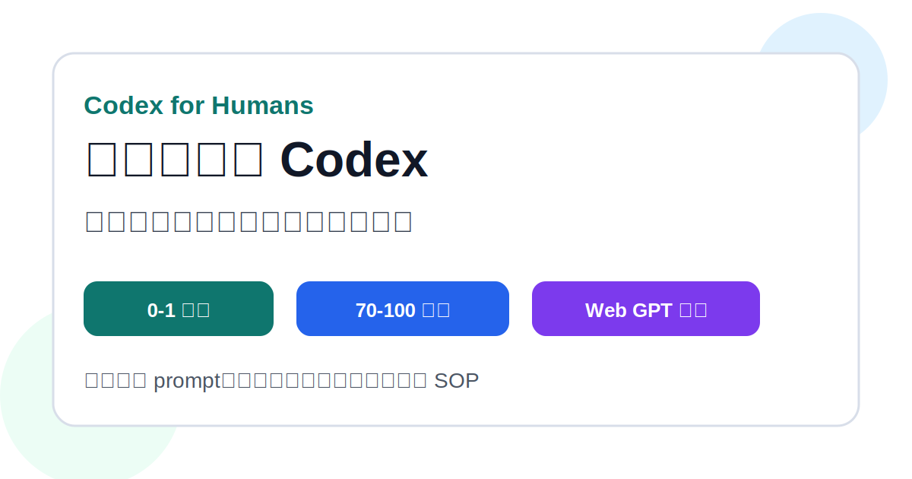
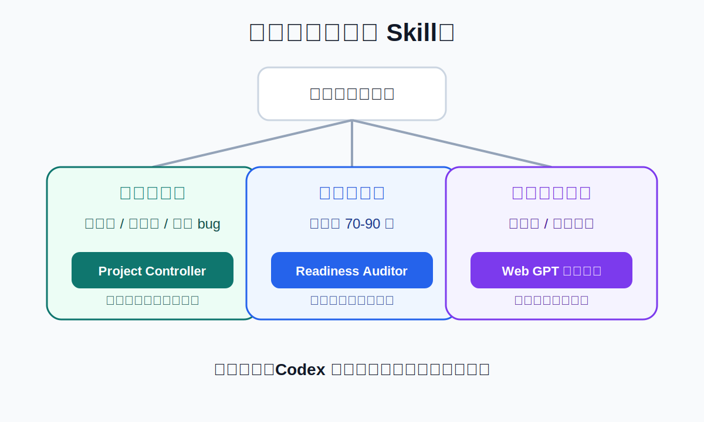
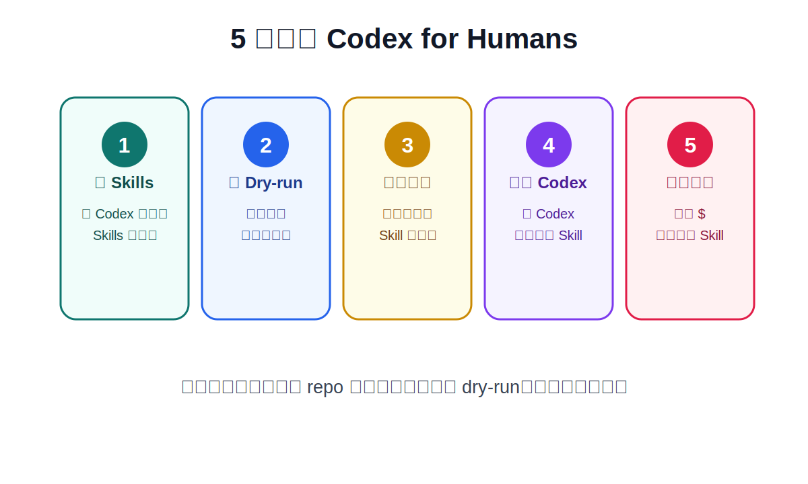
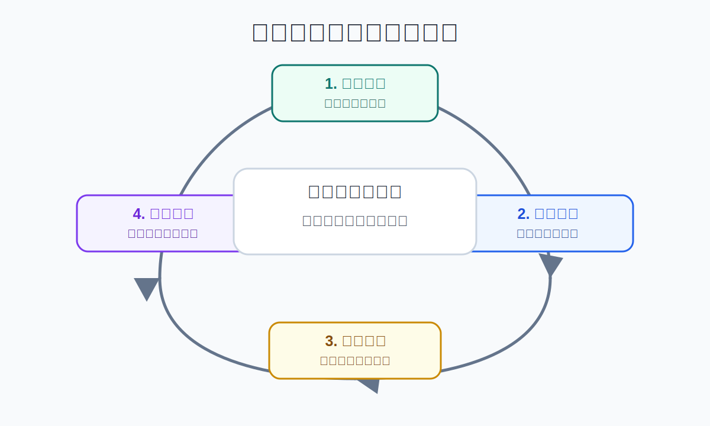

# Codex for Humans 新手教學

這份教學給完全不懂程式碼的人。

你不需要知道 Python、JavaScript、資料庫或部署是什麼。你只需要學會三件事：

1. 什麼時候讓 Codex 開始做。
2. 什麼時候讓 Codex 檢查能不能交付。
3. 什麼時候要停下來要求證據。



## 先看一張圖



最簡單的判斷方式：

```text
我還沒做出來：用 Project Controller
我已經快完成：用 Readiness Auditor
我想找外部模型挑錯：用 Web GPT，但它只能給意見
```

## 第一步：下載或打開 repo

GitHub repo：

```text
https://github.com/schmidtkaylan39-cpu/codex-for-humans
```

Release 下載：

```text
https://github.com/schmidtkaylan39-cpu/codex-for-humans/releases/latest
```

如果你只是想使用，不需要看懂 repo 內每個檔案。

你只要知道：

- `skills/`：放給 Codex 使用的兩個 Skill。
- `prompts/`：放可以直接貼給 Codex 的提示詞。
- `docs/`：放新手說明。
- `examples/`：放完整案例。

## 第二步：安裝兩個 Skill



先找到你的 Codex Skills 資料夾。

常見位置可能是：

```text
~/.agents/skills/
~/.codex/skills/
```

請以你目前 Codex 顯示的 Skills 資料夾為準。

新手建議先跑 dry-run。dry-run 只會顯示安裝計畫，不會真的複製檔案。

Windows：

```powershell
powershell -ExecutionPolicy Bypass -File .\scripts\install.ps1 -DryRun
powershell -ExecutionPolicy Bypass -File .\scripts\install.ps1
```

macOS / Linux：

```bash
bash ./scripts/install.sh --dry-run
bash ./scripts/install.sh
```

安裝後重開 Codex，確認能看到：

```text
nontechnical-codex-project-controller
nontechnical-project-readiness-auditor
```

## 第三步：依照你的情況選 prompt

### 情況 A：我想從 0 開始做一個專案

使用：

```text
prompts/01-start-new-project.md
```

或直接對 Codex 說：

```text
使用 $nontechnical-codex-project-controller
我想做一個預約系統，請先幫我整理需求，不要直接開始寫程式。
```

適合：

- 新網站
- 新工具
- 新系統
- 新功能
- 比較大的 bug

### 情況 B：我的專案已經 70-90 分，但不知道能不能交付

使用：

```text
prompts/02-audit-70-to-100-project.md
```

或直接對 Codex 說：

```text
使用 $nontechnical-project-readiness-auditor
幫我檢查這個專案離交付還差什麼。
不要大改功能，先盤點現況、未測項目、高風險點和最小收尾任務。
```

適合：

- 已經能打開的網站
- 功能大多完成的工具
- 不知道還缺哪些測試的專案
- 不敢確定能不能交付的專案

### 情況 C：只是小任務

使用：

```text
prompts/05-quick-daily-task.md
```

小任務不需要完整 SOP。

例如：

- 改一句文案
- 修一個小錯字
- 調整 README
- 小型樣式修正

## 第四步：不要只看分數



新手最容易問：

```text
現在幾分？
```

更好的問法是：

```text
哪些已經測過？
哪些還沒測？
哪些沒測會影響交付？
如果失敗，我會看到什麼現象？
下一步最小收尾任務是什麼？
```

分數只是摘要。

真正決定能不能交付的是：

- 核心流程是否測過
- 高風險點是否處理
- 是否有明確啟動方式
- 是否有失敗時的回復方式
- 是否沒有碰到真錢、真實資料、正式上線等高風險操作

## 第五步：Web GPT 只能當外部審查

Web GPT 可以幫你挑錯，例如：

- 需求有沒有漏
- 風險有沒有漏
- 測試有沒有漏
- 交付判斷會不會太樂觀

但 Web GPT 不能證明你的本機專案真的能跑。

正確流程是：

```text
Codex 本機執行
Codex 本機測試
必要時整理安全審查包給 Web GPT
Web GPT 回覆後貼回 Codex
Codex 判斷哪些要採用
Codex 再本機驗證
```

## 第六步：遇到高風險就停

如果任務碰到下面任何一項，先停下來，不要直接讓 Codex 做正式操作：

- 真錢
- 真實交易
- 正式部署
- 真實用戶資料
- 登入和權限
- 刪除資料
- 付費 API
- API key、token、cookie、密碼

你可以對 Codex 說：

```text
這是高風險任務。
請先建立批准點、測試方式、回復方式。
不要碰真實資料，不要執行正式操作。
```

## 一個完整小白用法

你可以直接貼這段給 Codex：

```text
使用 $nontechnical-codex-project-controller

我是非技術負責人，看不懂程式碼。
我想做一個小型預約系統。

請先不要寫程式。
請先用白話幫我完成：
1. 任務分類
2. 需求整理
3. 範圍內 / 範圍外
4. 成功標準
5. 高風險停止點
6. 下一步最小執行計畫

如果需要我選擇，請給 A/B/C 三個選項，不要問開放式問題。
```

如果專案快完成，改貼這段：

```text
使用 $nontechnical-project-readiness-auditor

我是非技術負責人，看不懂程式碼。
這個專案看起來已經 80-90 分，但我不知道能不能交付。

請不要大改功能。
請先幫我做：
1. 現況盤點
2. 未測項目分類
3. 高風險點清單
4. 交付阻塞
5. 非技術驗收腳本
6. 下一步最小收尾任務
```

## 最重要的一句話

```text
不要讓 Codex 只是一直改。
要讓 Codex 每一輪都留下範圍、證據、結果和下一步。
```
